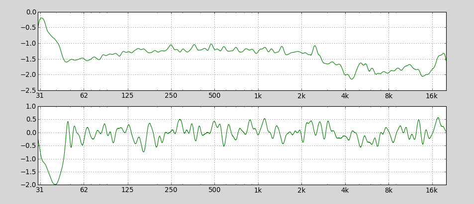

Getting Started
===============

To start measuring your audio hardware or listening environment, you need:

- A computer with a soundcard
- A *measuring* microphone
- *Kuray*

Measuring Frequency Response
----------------------------

The first thing you might want to try is measure the frequency response
of a loudspeaker. Actually, unless you happen to have acces to an 
`anechoic chamber`_, you'll be measuring the combination of your speaker and 
your room (and your microphone).

To do this with *Kuray* you need to plug in a microphone into
your soundcards input. Beware to set up your sound settings not to output the
signal of your microphone directly to the speakers to avoid feedback.
Start *Kuray* and hit *Measure*. It will generate and play a sine sweep,
record it via the microphone and then calculate the frequency response from
that. You should get a plot like this:

.. _anechoic chamber: https://en.wikipedia.org/wiki/Anechoic_chamber
